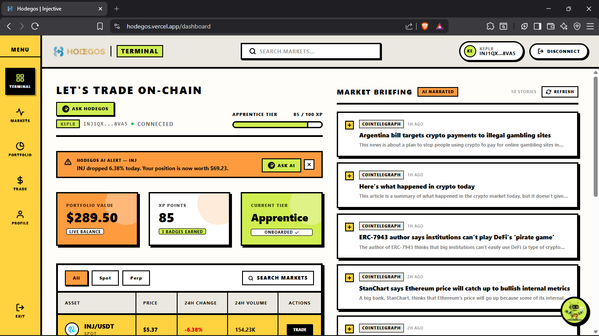
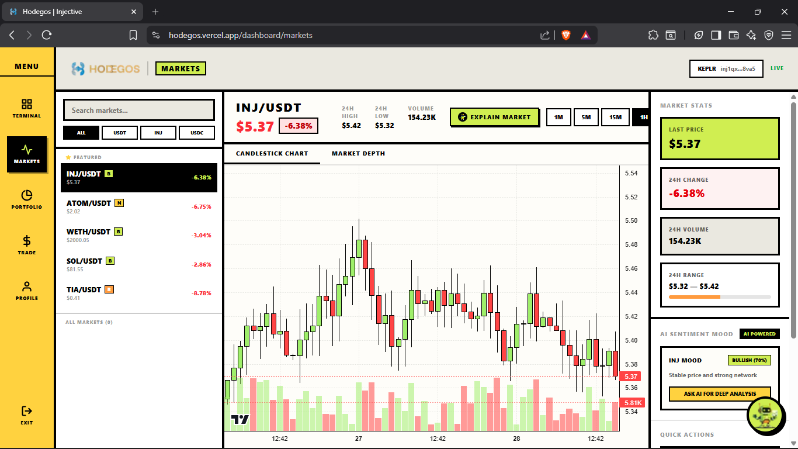
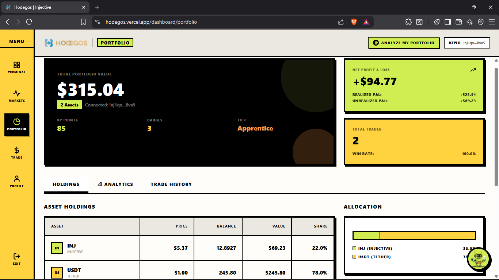
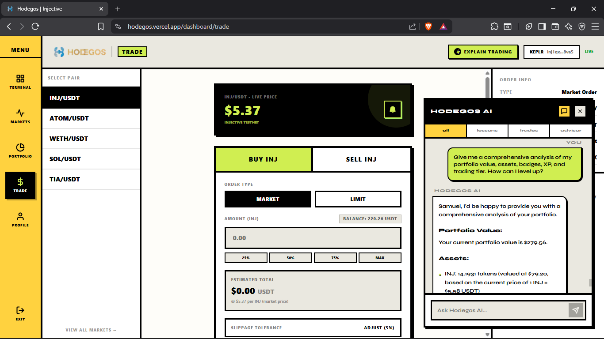

# Hodegos

**Deployed:** [https://hodegos.vercel.app](https://hodegos.vercel.app)  
**Repository:** [https://github.com/SamuelOluwayomi/Hodegos](https://github.com/SamuelOluwayomi/Hodegos)  
**Built for:** Injective Solo AI Builder Sprint (May 11 - May 31, 2026)

---

## Overview

**Hodegos** (Greek for "Guide") is an AI-powered trading terminal built natively on the Injective blockchain. It solves a clearly defined problem: the crypto trading environment is hostile to newcomers. Most trading interfaces assume fluency with concepts like orderbooks, slippage, subaccounts, and base/quote denomination — concepts that take months to internalize.

Hodegos removes that barrier. It is a Consumer AI App that layers an intelligent, conversational AI companion on top of a fully functional Injective DEX interface, allowing a complete beginner to learn trading fundamentals, practice without risk, and execute real on-chain spot trades — all in a single product.

The platform is live, wallet-connected, and functional on Injective Testnet for transactions with Mainnet price data powering all market displays.

---

## How AI is Used

AI is not a cosmetic feature in Hodegos. It is the core interaction layer. Three distinct AI systems operate within the application:

### 1. Hodegos AI Copilot (Conversational Agent)

The primary AI interface is a persistent, context-aware chatbot powered by the Groq API (Llama-3.3-70b-versatile). It is embedded across every page of the dashboard and understands the user's current context: what page they are on, their live portfolio value, their XP level, and their trading history.

Key behaviours:

- **Onboarding and assessment:** On first login, the AI conducts a guided onboarding session. It assesses the user's existing knowledge level through a short conversational quiz, then tailors the tutorial content accordingly.
- **Contextual education:** The AI answers questions about trading mechanics, Injective-specific features (subaccounts, DEX orderbooks, spot markets, perpetuals), and portfolio strategy using plain language.
- **Intent-to-transaction parsing:** When the user expresses a trade intent in natural language (for example, "buy 2 INJ"), the AI parses the intent, extracts structured parameters (pair, side, amount, order type), and pre-fills the trade execution panel for user confirmation.
- **Portfolio analysis:** The AI can be prompted to provide a full breakdown of the user's on-chain holdings, P&L figures, badge progress, and XP tier with specific, numbered recommendations.
- **Rebalance advisor:** Within the Portfolio page, the AI generates a precise rebalancing recipe — including exact USD amounts to swap — to move the user's allocation toward a target weighting.

The AI is categorised into tabs within the chat interface: All, Lessons, Trades, and Advisor, each scoping the conversation to a specific domain.

### 2. AI-Narrated Market Briefing

Hodegos automatically fetches the latest crypto news headlines from the Cointelegraph RSS feed on a 30-minute refresh cycle. Rather than displaying raw article titles, the Groq API (Llama-3.1-8b-instant) rewrites each headline into a two-sentence, jargon-free summary explicitly framed for a beginner trader.

The result is a live "Market Briefing" sidebar on the dashboard that gives users market awareness without requiring them to interpret financial news on their own. A manual refresh button is also available for users who want to pull the latest batch immediately.

### 3. AI Agentic Portfolio Alerts

After the user's wallet balances are loaded, an agentic system runs a one-time portfolio evaluation per session. It calls the CoinGecko API to retrieve real 24-hour price change data for every asset the user holds, then submits a structured prompt to the Groq API requesting analysis.

The AI generates 0 to 2 short, actionable alerts based on two conditions:
- A price move greater than 4% in 24 hours for any held asset
- A single asset making up more than 65% of the total portfolio value

These alerts appear as dismissable banners on the dashboard and are always grounded in real market data — not simulated figures.

### 4. AI Market Sentiment

On the Markets page, each trading pair has an AI Sentiment panel. The AI ingests the live price and 24-hour change for the selected asset and generates a directional sentiment label (Bullish, Bearish, or Neutral) with a confidence percentage and a one-line human-readable summary. This gives beginners a starting mental model before they read the candlestick chart.

---

## Injective Integration

Hodegos uses the `@injectivelabs/sdk-ts` and `@injectivelabs/networks` packages for all on-chain interactions.

### Market Data

The application fetches real-time market data — prices, 24-hour highs and lows, 24-hour change percentages, and trading volume — directly from the Injective Mainnet exchange API. This data populates the Markets page, the Terminal dashboard, and all AI prompts that reference price context.

### On-Chain Trade Execution

Users connect their Web3 wallet (Keplr, Leap, or Ninji) through the Injective wallet integration layer. The Trade page supports:

- **Spot market orders** via `MsgCreateSpotMarketOrder`
- **Spot limit orders** via `MsgCreateSpotLimitOrder`
- **Subaccount management** via `getDefaultSubaccountId`
- **Transaction signing and broadcasting** via `TxGrpcApi` and `createTxRawFromSigResponse`

All transactions are routed to **Injective Testnet**, giving users real order execution mechanics without financial risk. The supported trading pairs are INJ/USDT, ATOM/USDT, WETH/USDT, SOL/USDT, and TIA/USDT.

Slippage tolerance is configurable per trade (default 5%). Quantity and price values are scaled to the correct Injective decimal representation per asset using the SDK's denomination system.

### Wallet Balance Fetching

Live token balances are fetched from the Injective Testnet chain using `IndexerGrpcAccountPortfolioApi`. Balances are denominated using the correct Injective denom identifiers for each supported asset and converted to human-readable amounts using `denomAmountToChainDenomAmountToFixed`.

---

## User Journey

```
Connect Wallet
     |
     v
AI Onboarding Assessment
(AI asks 3-4 questions to gauge knowledge level)
     |
     v
Dashboard — Terminal View
  - Live market prices from Injective Mainnet
  - Portfolio value from live on-chain balances
  - AI agentic alerts based on real 24h price data
  - AI-narrated news briefing from Cointelegraph RSS
     |
     |---- Markets Page
     |       Live candlestick chart (TradingView widget)
     |       Market depth visualization
     |       AI sentiment rating per asset
     |       AI "Explain this market" button
     |
     |---- Trade Page
     |       Select pair, order type (market or limit)
     |       Live price display from Injective Mainnet
     |       AI "Explain trading" button
     |       Transaction signing and broadcasting to Injective Testnet
     |
     |---- Portfolio Page
     |       Holdings table with live on-chain balances
     |       Net P&L, realized and unrealized breakdown
     |       Trade history from Supabase
     |       Analytics: Pie, Bar, and Area charts
     |       AI rebalance advisor panel
     |
     |---- Profile Page
             XP progress, badge collection
             Tier system (Apprentice, Trader, Expert, Master)
             AI copilot accessible from any page
```

---

## Gamification and Progression System

To sustain engagement, Hodegos implements an XP and tier system stored in Supabase:

- Users earn XP by completing AI onboarding, answering quiz questions correctly, and executing trades.
- XP is mapped to tiers: Apprentice, Trader, Expert, and Master.
- Badges are awarded for specific milestones (first trade, onboarding completion, portfolio diversification).
- The tier and XP progress bar are displayed persistently in the terminal header.

---

## Architecture

```
Frontend (Next.js App Router)
  |
  |-- app/dashboard/page.tsx         Terminal: balances, alerts, news, markets
  |-- app/dashboard/markets/page.tsx Live candlestick + AI sentiment
  |-- app/dashboard/trade/page.tsx   Order entry + on-chain execution
  |-- app/dashboard/portfolio/page.tsx Holdings, P&L, charts, rebalance advisor
  |-- app/dashboard/profile/page.tsx XP, badges, tier
  |
  |-- app/api/news/route.ts           Fetches Cointelegraph RSS, AI-summarizes via Groq
  |-- app/api/alerts/route.ts         CoinGecko prices + Groq AI alert generation
  |-- app/api/portfolio/route.ts      Injective Testnet balance fetch via SDK
  |-- app/api/chat/route.ts           Streaming Groq LLM responses for chatbot
  |-- app/api/markets/summary/route.ts Injective Mainnet market price fetch
  |-- app/api/trades/route.ts         Supabase trade history read/write
  |
  |-- lib/injective.ts               Injective SDK wrappers, market IDs, price fetch
  |-- lib/useWallet.ts               Wallet connection state (Keplr, Leap, Ninji)
  |-- hooks/useChat.ts               Supabase profile + XP + badge management
  |
Backend / Data
  |-- Groq API (LLM)                 llama-3.3-70b-versatile, llama-3.1-8b-instant
  |-- Injective SDK                  @injectivelabs/sdk-ts, @injectivelabs/networks
  |-- Supabase                       User profiles, XP tracking, trade history
  |-- CoinGecko API                  Real-time 24h price change for alert generation
  |-- Cointelegraph RSS              Live news headlines (no API key required)
  |-- TradingView Widget             Embedded candlestick charts
```

---

## Tech Stack

| Layer | Technology |
|---|---|
| Frontend Framework | Next.js 14 (App Router), React 18 |
| Language | TypeScript |
| Styling | Tailwind CSS |
| AI / LLM | Groq API — Llama-3.3-70b-versatile and Llama-3.1-8b-instant |
| Blockchain SDK | @injectivelabs/sdk-ts, @injectivelabs/networks |
| Database | Supabase (PostgreSQL) |
| Charts | Recharts (portfolio analytics), TradingView embedded widget |
| Icons | Phosphor Icons |
| Deployment | Vercel |

---

## Local Development

### 1. Clone and Install

```bash
git clone https://github.com/SamuelOluwayomi/Hodegos.git
cd Hodegos
npm install
```

### 2. Environment Variables

Create a `.env.local` file in the root directory with the following keys:

```env
# AI — Required for all chatbot, news, and alert features
GROQ_API_KEY=your_groq_api_key_here

# Database — Required for XP, badges, profiles, and trade history
NEXT_PUBLIC_SUPABASE_URL=your_supabase_project_url
NEXT_PUBLIC_SUPABASE_ANON_KEY=your_supabase_anon_key
```

Groq API keys are free to obtain at [console.groq.com](https://console.groq.com). Supabase projects are free at [supabase.com](https://supabase.com).

### 3. Run the Development Server

```bash
npm run dev
```

Open [http://localhost:3000](http://localhost:3000) in your browser.

### 4. Wallet Setup

Install the [Keplr browser extension](https://www.keplr.app/) and switch to the Injective Testnet network to interact with the trade execution features. Testnet INJ tokens can be obtained from the [Injective Testnet Faucet](https://testnet.faucet.injective.network/).

---

## Screenshots

### Terminal Dashboard
Live portfolio value, on-chain market prices, AI agentic alerts, and AI-narrated news briefing.



### Markets Page
Real-time candlestick chart with TradingView, market stats, and AI sentiment analysis per asset.



### Portfolio Page
On-chain holdings table, realized and unrealized P&L, allocation charts, and AI rebalance advisor.



### Trade Page
Spot market and limit order execution on Injective Testnet with live Mainnet price reference and AI trading explainer.



---

## Roadmap

The following are planned improvements beyond the sprint scope:

- **Injective Orderbook Integration:** Pull live bid/ask spread data from Injective's on-chain orderbook directly into the AI prompt for real-time depth-aware trade recommendations.
- **Automated Portfolio Rebalancing:** Allow the AI agent to autonomously execute a series of market orders to restore a user-defined target allocation, with a confirmation step before any transactions are signed.
- **Perpetuals Trading Support:** Extend the trade execution panel to support Injective perpetual markets, including margin and leverage input with AI-guided risk warnings.
- **Multi-Wallet Portfolio Tracking:** Allow users to add read-only wallet addresses for portfolio tracking without requiring connection.
- **Mobile Responsive Layout:** Fully responsive dashboard optimised for mobile browsers.

---

## Built By

Samuel Oluwayomi  
GitHub: [github.com/SamuelOluwayomi](https://github.com/SamuelOluwayomi)  
X: [@The_devsam](https://x.com/The_devsam)
